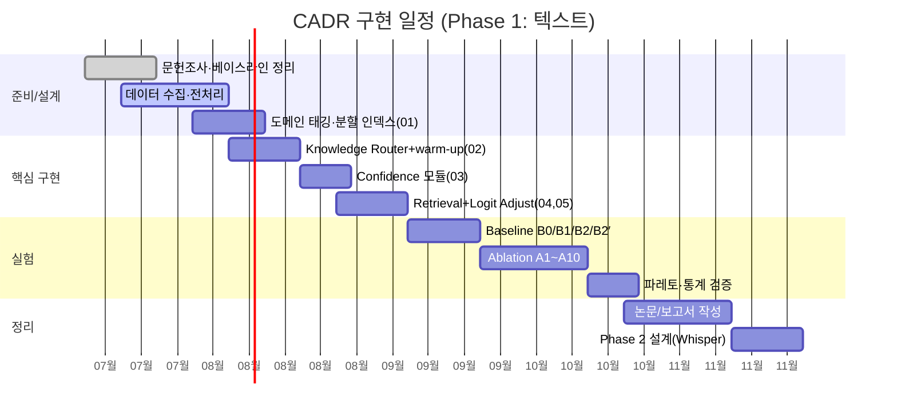

# 07 · 로드맵 (일정 · 복잡도 · Whisper 확장)

---

## 7.1 예상 성능 (목표/가설)

> 아래는 검증으로 확인할 **목표치**이며 실측이 아니다.

| 모델 | Domain Term Acc | Retrieval 비율 ρ | 상대 Latency |
|---|---|---|---|
| B0 Baseline | ~62% | 0% | 1.0× |
| B1 Always Retrieval | ~81% | 100% | ~2.3× |
| **B2 CADR (제안)** | **~79–82%** | **~20–30%** | **~1.3–1.4×** |

기대 골자: B2는 B1 대비 검색 호출을 **70~80% 절감**하면서 정확도는 **동등(±2%p)** 유지.

---

## 7.2 계산 복잡도 (세 축 반영)

인코더 forward `C_enc`, 단일 retrieval `C_ret`, logit 보정 `C_adj`.

- **B0**: `C_enc`
- **B1**: `C_enc + C_ret + C_adj`
- **B2 (CADR)**: `C_enc + ρ·(C_ret(scope) + C_adj)`,  `ρ = P(c(p) < τ)`

절감량:

$$
\Delta = (1-\rho)\,\big(C_{\text{ret}}(\text{scope}) + C_{\text{adj}}\big)
$$

**두 절감 축이 곱해진다:**

1. **검색 횟수 축**: `ρ` — confidence trigger(`03`)로 축소.
2. **검색 비용 축**: `C_ret(scope)` — 도메인 라우팅(`01`,`02`,`04`)으로 ANN 후보가
   `N_all → N_domain` 이 되어

$$
C_{\text{ret}} : O(d + \log N_{\text{all}}) \ \longrightarrow\ O(d + \log N_{\text{domain}})
$$

3. **활성화 시점 축**: warm-up(`02`)은 비용이 아니라 **정확도/안정성** 이득
   (초반 오라우팅 방지). warm-up 동안 `scope=General` 이므로 이 구간 검색 비용은
   `C_ret(General)` 로 계산.

기타:
- Confidence 계산 `c(p)`: 이미 계산된 softmax에 대해 `O(|V|)`(top-2 정렬 포함) — 사실상 무시 가능.
- Router 누적 `S_t(d)`: 도메인 수 `|Dom|` 에 대해 `O(|Dom|)` per step — 무시 가능.
- 결론: `ρ` 가 작고 `N_domain ≪ N_all` 일수록 B1 대비 선형+로그 절감 → **순이득**.

---

## 7.3 구현 일정 (Gantt)

(주: 날짜는 착수 시점 예시이며 실제 일정에 맞춰 조정.)

---

## 7.4 Whisper 확장 (Phase 2)

Phase 1의 (confidence trigger → logit adjustment)와 (Knowledge Router warm-up)을
Whisper **autoregressive decoder** 에 이식한다.

### 매핑
- BERT MLM logits ↔ Whisper decoder의 **step별 vocabulary logits**.
- 마스크 위치 판단 ↔ **디코딩 각 스텝** 에서 confidence 계산.
- 도메인 용어집 bias ↔ 동일하게 step logits에 `z' = z + λ·b`.
- **warm-up 창 `W`(토큰) ↔ 실제 오디오 앞 ~30초**: 텍스트에서 `W` 토큰으로 정의한 warm-up 이
  음성에서는 "초반 ~30초 general → 도메인 확정 시 특화 활성"으로 실체화된다.
  Early Lock(강한 초반 확신 시 조기 진입)과 히스테리시스(잦은 도메인 전환 억제)도 그대로 이식된다.

### 도전 과제와 대응
1. **자기회귀 오류 전파**: beam search 상에서 보정, 낮은 confidence 스텝에만 개입해 보정 빈도 제한.
2. **음향 근거 보존**: 가산 방식(A)은 음향 posterior 유지 + 도메인 prior만 가산(shallow fusion 유사).
3. **실시간 제약**: streaming에서는 `ρ` 를 낮게(높은 `τ`) 유지해 latency budget 준수.
   warm-up 은 방송 초반 오라우팅을 막아 실시간 안정성에도 기여.
4. **인덱스 재사용**: Phase 1의 도메인 용어집/FAISS 인덱스를 그대로 활용(음성 비의존).

### 평가 확장
- WER / Domain-term WER, RTF(real-time factor), retrieval 비율, Routing Accuracy, Time-to-Lock.
- 스포츠 중계·게임 방송·기술 강연 자막에서 A/B 비교.

---

## 7.5 향후 확장
- Whisper Decoder 적용, Dynamic Threshold Learning(`τ`, `τ_dom` 학습).
- Retrieval Controller 학습(trigger 정책), Domain-specific Logit Bias 자동 학습.
- Router drift 재라우팅 정책 고도화(`02` 2.5절), 실시간 자막 시스템 통합.
