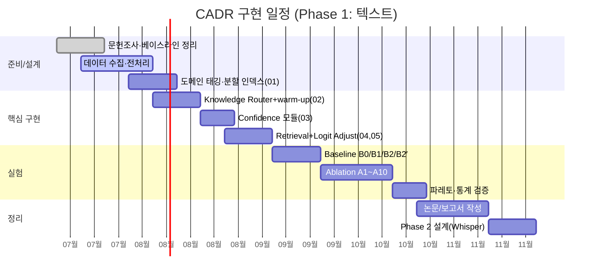

# CADR — Confidence-Aware Domain Retrieval for Subtitle Post-processing

> **한 줄 요약**
> ASR/자막 후처리에서, 모델이 **불확실한 순간에만** 검색하고(confidence trigger),
> 검색 결과를 재생성이 아니라 **예측(logit) 단계에서 보정**하며(logit adjustment),
> 검색 범위는 **도메인 라우팅으로 좁혀**(Knowledge Router) 연산량과 지연시간을 함께 줄인다.

이 문서는 **허브(hub)** 다. 전체 흐름과 파트 간 관계만 정의하고,
각 파트의 세부 스펙은 아래 스포크(spoke) 파일에 있다.
문서 파일은 향후 코드 모듈과 1:1로 대응하도록 쪼개져 있다.

---

## 핵심 질문

> 모델의 내부 불확실성(confidence)을 Retrieval Trigger로 사용하고,
> 그 결과를 생성 이후가 아니라 **예측(logit) 단계에서 보정**할 경우,
> 기존 RAG 대비 **더 적은 Retrieval 호출로 동등하거나 더 높은 도메인 정확도**를
> 달성할 수 있는가?

세부 목표(G1–G4):

- **G1** Retrieval Trigger를 입력이 아닌 **모델 내부 상태(confidence)** 로 정의·검증.
- **G2** Retrieval 결과를 **logit bias** 로 주입해 재생성 없이 예측을 교정.
- **G3** Retrieval 호출 비율 대비 정확도의 **파레토 우위** 실증.
- **G4** 텍스트(MLM) 환경 검증 후 Whisper Decoder로 확장 가능한 일반 알고리즘 확립.

---

## 세 축의 절감 전략 (직교)

CADR의 효율성은 **서로 곱해지는 세 축**에서 나온다.

| 축 | 무엇을 정하는가 | 담당 파트 | 절감 대상 |
|---|---|---|---|
| **(1) 검색 여부** | 검색을 할지 말지 | `03_confidence_trigger` | 검색 **횟수** `ρ` |
| **(2) 검색 범위** | 검색한다면 어디를 볼지 | `01`, `02`, `04` | 검색 **1회당 비용** `C_ret` |
| **(3) 활성화 시점** | 언제부터 도메인 특화를 켤지 | `02_knowledge_router` | **cold-start 오라우팅** 방지 |

총비용 근사:

```
총비용 ≈ C_enc + ρ · C_ret(scope)

  ρ           ← (1) confidence trigger 로 축소
  C_ret(scope)← (2) 도메인 라우팅으로 N_all → N_domain 축소
  scope 활성화← (3) warm-up 이후에만 domain scope 적용
```

- (1)은 검색 **횟수**를 줄이고, (2)는 검색 **한 번의 비용**을 줄인다 → 곱셈으로 절감.
- (3)은 비용이 아니라 **정확도/안정성** 축이다. 문맥이 부족한 초반에 성급히 도메인을
  확정하면 오라우팅으로 오히려 정확도가 떨어지므로, **처음엔 general knowledge만**(warm-up,
  토큰 기준) 쓰고 라우터가 확신할 때 도메인 특화를 켠다. 단 초반부터 확신이 매우 높으면
  **Early Lock**으로 조기 진입(실시간성)하고, 한 번 lock된 도메인은 **히스테리시스**로
  작은 변화엔 유지해 잦은 전환을 막는다(→ `02`).

---

## 두 종류의 confidence (혼동 주의)

CADR에는 이름이 비슷하지만 **역할이 다른 두 confidence**가 있다. 파트가 다르다.

| | Router Confidence | Token Confidence |
|---|---|---|
| 질문 | "이 문서/발화가 **어느 도메인**인가?" | "이 **마스크 토큰**을 내가 아는가?" |
| 대상 | 문서 초반부 누적 근거 | 개별 예측 분포 `p` |
| 임계값 | `τ_dom` (도메인 lock-in) | `τ` (retrieval trigger) |
| 결과 | warm-up 종료 & domain scope 활성화 | 이 토큰에서 retrieval 수행 여부 |
| 파트 | `02_knowledge_router` | `03_confidence_trigger` |

---

## 전체 파이프라인 (Build-time vs Run-time)

```
[BUILD-TIME  (오프라인 전처리)]   ── 01_preprocessing_index
   Wiki/나무위키 문서
     → 카테고리 기반 규칙 태깅(Domain Tag)
     → 도메인별 분할 인덱스 (Sports / Game / AI / Cooking / Music)  + 도메인 용어집(FAISS)

────────────────────────────────────────────────────────────

[RUN-TIME  (디코더 입력부터, 토큰/스텝 단위 스트림)]

   토큰 스트림 t = 1,2,3, ...
        │
        ├─► Knowledge Router (02)  ── 매 스텝 도메인 근거 누적
        │       state = WARMUP | LOCKED(domains)
        │       WARMUP 조건: t < W  또는  라우터 미확신
        │       LOCK-IN:    top-k 도메인 점수 ≥ τ_dom  → scope = 그 도메인(들)
        │
        ▼
   scope = GENERAL (warm-up 중)  또는  LOCKED domain index(들) (lock 이후)
        │
        ▼
   Encoder(BERT/RoBERTa) → MLM logits z → p = softmax(z)
        │
        ▼
   Token Confidence c(p)        ── 03_confidence_trigger
        ├── c ≥ τ (High) ───────────────► output = argmax p          (검색 없음)
        └── c <  τ (Low)
                │
                ▼
          Retrieval R(context, scope) → bias b   ── 04_retrieval
                │   (scope 안에서만 검색; 부족하면 외부 dynamic retrieval)
                ▼
          Logit Adjustment z' = z + λ·b          ── 05_logit_adjustment
                ▼
          output = argmax softmax(z')
```

> **텍스트(Phase 1)에서의 "초반 30초" 정의**: 영상/음성이 아니라 **디코더 입력**부터
> 시작하므로, warm-up 창 `W`는 **문서 초반부**(앞쪽 N 토큰/문장)로 정의한다.
> Phase 2(Whisper)에서는 이 `W`가 자연스럽게 **실제 오디오 앞부분 ~30초**로 매핑된다
> (→ `07_roadmap`).

---

## 파일 맵

| 파일 | 내용 | 시점 | 향후 코드 모듈(예상) |
|---|---|---|---|
| `README.md` | 허브: 흐름·아키텍처·용어 | — | — |
| `01_preprocessing_index.md` | KB 구축·도메인 태깅·인덱스 분할 | Build | `indexer/`, `tagging/` |
| `02_knowledge_router.md` | 도메인 라우팅 + warm-up/lock-in | Run | `router/` |
| `03_confidence_trigger.md` | 토큰 confidence·trigger 수식 | Run | `trigger/` |
| `04_retrieval.md` | scope 검색 + dynamic retrieval | Run | `retrieval/` |
| `05_logit_adjustment.md` | 방식 A/B 보정 | Run | `adjust/` |
| `06_experiments.md` | 데이터셋·지표·baseline·ablation | — | `eval/` |
| `07_roadmap.md` | 일정·복잡도·Whisper 확장 | — | — |

`assemble.sh` 를 실행하면 위 파일을 순서대로 이어붙여 **단일 제출용 계획서**(`CADR_plan_full.md`)를 생성한다.

---

## 기존 연구 대비 위치 (요약)

| 항목 | Self-RAG | FLARE | Adaptive-RAG | **CADR (본 연구)** |
|---|---|---|---|---|
| Trigger 신호 | 학습된 reflection token | 미래 문장 저확신 토큰 | 입력 복잡도 분류기 | **현재 예측 confidence(margin/entropy)** |
| 보정 방식 | 재생성+self-critique | 재검색 후 재생성 | 경로 라우팅 후 생성 | **logit bias 주입(재생성 없음)** |
| 개입 지점 | 생성 | 생성 | 생성 | **예측(logit) 단계** |
| 검색 범위 | 전역 | 전역 | 전역 | **도메인 라우팅으로 축소** |
| 활성화 시점 | 항상 | 항상 | 항상 | **warm-up 후 도메인 확신 시** |

FLARE와 confidence-trigger 철학은 공유하되, CADR은 **(1) logit 보정, (2) 도메인 라우팅+용어집,
(3) warm-up 후 특화 활성화, (4) 무학습 이식 가능**의 결합에서 차별화된다.


---

# 01 · 전처리 및 도메인 인덱스 구축 (Build-time)

> **시점**: 오프라인(추론 이전). 이 파트의 산출물은 런타임에서 읽기 전용으로 소비된다.
> **역할**: 검색 대상을 미리 도메인별로 분할해 두어, 런타임 검색 1회당 비용 `C_ret` 를 줄인다.
> 이는 RAG에서 문서를 청킹→임베딩→벡터 인덱스로 올려두는 전처리와 같은 층위이며,
> 여기에 **도메인 태깅** 축을 하나 더 얹은 것이다.

일반 RAG 전처리와의 차이:

```
일반 RAG : 문서 → 임베딩 → 단일 벡터 인덱스
CADR     : 문서 → 도메인 태깅 → 도메인별 분할 인덱스 (Sports / AI / Game / ...)
```

---

## 1.1 Domain Knowledge Base 구축

범용 지식 저장소로 **위키 기반 문서**(Wikipedia / 나무위키)를 활용한다.
모든 문서를 하나의 저장소에 보관하되, 각 문서에 미리 **도메인 태그(Domain Tag)** 를 부여한다.

- 저장소는 논리적으로 하나지만, 인덱스는 도메인 태그 기준으로 **물리적/논리적으로 분할**된다.
- 한 문서가 복수 도메인 태그를 가질 수 있다(multi-tag). 예: 이스포츠 선수 문서 = `Game` + `Sports`.

---

## 1.2 규칙 기반 태깅 (Rule-based Tagging)

초기 구현에서는 별도의 분류 모델을 학습하지 않고, 위키가 제공하는 **카테고리(Category)** 정보를
이용한 규칙 기반 태깅을 사용한다.

```
문서 : 손흥민
Category : 축구 / 프리미어리그 / 대한민국 축구 국가대표
   ↓
Domain Tag : Sports
```

```
문서 : ChatGPT
Category : 인공지능 / 자연어처리 / 대규모 언어 모델
   ↓
Domain Tag : AI
```

### 매핑 규칙 설계

- **카테고리 → 도메인 사전**을 수작업/반자동으로 구축한다(예: `축구, 야구, 농구 → Sports`).
- 한 문서에 여러 카테고리가 있으면, 매핑된 도메인들의 **다중 태그**를 부여한다.
- 매핑되지 않는 카테고리만 남는 문서는 `General` 로 분류한다.
- (후속 옵션) 규칙으로 애매한 문서는 경량 분류기로 보완 가능하나, Phase 1은 **무학습 규칙**만으로 동작.

---

## 1.3 대상 도메인

Phase 1 스코프 도메인:

```
Sports / Game / AI / Cooking / Music   (+ General)
```

- `General` 은 warm-up 구간 및 도메인 미확정 시의 기본 scope로도 쓰인다(→ `02`, `04`).

---

## 1.4 도메인 용어집 & 벡터 인덱스 (Retrieval Index)

각 도메인별로 **용어·밈·고유명사·전문용어**를 정규화하여 임베딩 인덱스로 구축한다.

- 임베딩 인덱스: **FAISS (HNSW)**.
- 인덱스는 도메인 단위로 분리 → 런타임에 활성 도메인의 인덱스만 로드/조회.
- 각 엔트리: `(용어 표면형, 정규화형, 임베딩 key, 도메인 태그, 출처)`.

### 데이터 출처

| 출처 | 목적 |
|---|---|
| Wikipedia | 일반 지식 |
| 나무위키 | 한국어 용어 사전, 도메인 용어집 시드 |
| Reddit | 구어/신조어 |
| YouTube Transcript | 자막 도메인 분포 |

---

## 1.5 산출물 (런타임 계약)

이 파트가 런타임에 넘기는 인터페이스:

```
domain_index[domain] : FAISS index            # 도메인별 분할 인덱스
domain_glossary[domain] : {term → embedding}   # 도메인 용어집
tag_of(doc_id) : set[Domain]                    # 문서 → 도메인 태그
```

- `02_knowledge_router` 는 `domain` 집합을 결정하고,
- `04_retrieval` 은 결정된 `domain` 의 `domain_index` / `domain_glossary` 만 조회한다.

> **정합성 메모**: `C_ret` 의 ANN 검색 비용이 전역 `O(log N_all)` 에서
> 도메인 한정 `O(log N_domain)` 으로 내려가는 근거가 이 분할 인덱스다(→ `07_roadmap` 복잡도).


---

# 02 · Knowledge Router (도메인 라우팅 + Warm-up/Lock-in)

> **시점**: 런타임. 토큰/스텝 스트림과 병행하여 동작.
> **역할**: (a) 입력이 **어느 도메인**인지 판별하고, (b) **언제부터** 도메인 특화 기능을
> 켤지 결정한다. 기존 계획서의 "Domain Analyzer / Domain Classifier `D(context)`" 를
> 이 **Knowledge Router** 개념으로 대체·확장한다.

명칭 변경 이유: 기존 `Domain Analyzer` 는 "입력을 분석해 라벨을 붙인다"는 정적 뉘앙스였다.
본 파트는 라벨링에 더해 **어떤 지식 소스(scope)를 활성화할지 라우팅**하고, **상태를 전이**
(warm-up → locked)시키는 능동적 모듈이므로 **Knowledge Router** 가 더 정확하다.

---

## 2.1 왜 warm-up이 필요한가 (Cold-start 문제)

디코딩 초반에는 문맥이 거의 없어서 도메인 근거가 부족하다.
이때 성급히 도메인을 확정하면 **오라우팅(mis-routing)** 이 발생하고, 잘못된 도메인 용어집이
logit bias로 주입되어 오히려 정확도가 **떨어진다**(hallucination 재주입).

→ 해결: **초반에는 General knowledge만으로 돌리다가, 도메인이 확실해지면 특화 기능을 켠다.**

**Warm-up 창 `W` 는 문장 수가 아니라 토큰(Token) 수로 정의한다.**
자막 시스템은 문장 경계가 불명확하고 플랫폼·STT 방식에 따라 문장 분할이 달라지는 반면,
토큰은 모델 내부에서 일관된 단위로 쓰이므로 더 안정적인 기준이 된다.

- 텍스트(Phase 1): "초반"은 **디코더 입력의 앞쪽 `W` 토큰**.
  영상/음성이 아니라 **디코더 입력**부터 시작하므로 문서 초반부(토큰 기준)로 정의한다.
- 음성(Phase 2, Whisper): 이 `W` 토큰 창이 자연스럽게 **실제 오디오 앞 ~30초** 에 매핑된다(→ `07`).

---

## 2.2 라우터 상태 (State Machine)

```
        ┌─────────────┐
        │   WARMUP     │   scope = General, 도메인 근거 S[d] 누적
        │ (general만)  │
        └──────┬───────┘
               │  Base Lock ( t≥W ∧ maxS ≥ τ_dom )
               │  Early Lock( t<W ∧ maxS ≥ τ_early ),  τ_early > τ_dom
               ▼
        ┌─────────────┐
        │  LOCKED(D*)  │   scope = D* (1개 또는 top-k 다중 도메인)
        │ 도메인 특화 켜짐│  domain index + logit bias 활성
        └──────┬───────┘
               │  Hysteresis Unlock
               │  ( 반대도메인 우세 ≥ δ 가 연속 m 토큰 지속 )
               ▼
        (WARMUP 복귀 → 재-lock)
```

- **WARMUP**: `scope = General`. retrieval이 트리거돼도 General 인덱스만 조회.
  도메인 특화 logit bias는 **적용하지 않는다**.
- **LOCKED(D\*)**: `scope = D*`. `D*` 는 확정된 도메인 집합(단일 또는 다중).
  이후 검색·bias가 `D*` 인덱스/용어집으로 한정된다.

---

## 2.3 도메인 근거 누적 & Lock-in 규칙

Knowledge Router는 **Multi-label** 로 도메인을 판별한다(단일 분류 아님).
스텝 `t` 까지의 문맥으로 도메인 `d` 에 대한 순간 점수 `g_t(d) ∈ [0,1]` 를 얻고,
이를 누적해 안정적인 도메인 신뢰도 `S_t(d)` 를 만든다.

**누적(EMA):**

$$
S_t(d) = \gamma\, S_{t-1}(d) + (1-\gamma)\, g_t(d),
\qquad \gamma \in [0,1)
$$

**Top-k 선택 & Lock-in 조건.** 세 가지 규칙으로 도메인 특화를 켜고 끈다.

**(1) 기본 Lock (Base Lock)** — 성급한 고정 방지.
warm-up 종료(`t ≥ W`) 이후, 도메인 신뢰도가 임계값 `τ_dom` 이상일 때 lock.

$$
\text{Base Lock} \iff \Big( t \ge W \Big) \ \wedge\ \Big( \max_d S_t(d) \ge \tau_{\text{dom}} \Big)
$$

**(2) 조기 Lock (Early Lock)** — 실시간성 확보.
모델이 warm-up이 끝나기 전이라도 **매우 높은 확신**을 보이면 기다리지 않고 lock.
더 엄격한 임계값 `τ_early` (단, `τ_early > τ_dom`)를 사용한다.

$$
\text{Early Lock} \iff \Big( t < W \Big) \ \wedge\ \Big( \max_d S_t(d) \ge \tau_{\text{early}} \Big)
$$

즉 최종 lock 조건은 `Base Lock ∨ Early Lock`. `τ_early > τ_dom` 로 둠으로써,
문맥이 짧은 초반에는 어지간한 확신으로는 lock하지 않고 **확실할 때만** 조기 진입한다.

lock 시점의 활성 도메인 집합(top-k, 다중 허용):

$$
D^\* = \{\, d \ :\ S_t(d) \ge \tau_{\text{dom}} \,\}\ \ \text{(최대 } k \text{개)}
$$

- **단일 도메인**: 예) `S(Sports)=0.88` 하나만 초과 → `D* = {Sports}`.
- **다중 도메인(허용)**: 예) `S(Sports)=0.84, S(Game)=0.79` 둘 다 초과 → `D* = {Sports, Game}`
  (예: "축구 게임 방송" 처럼 축구+게임 동시 활성).

**(3) 히스테리시스 해제 (Hysteresis Unlock)** — 불필요한 전환 방지.
한 번 lock된 도메인은 작은 confidence 변화만으로 즉시 바꾸지 않는다.
현재 `D*` 밖 도메인의 신뢰도가 현재 도메인을 **`δ` 이상 우세**한 상태가
**연속 `m` 토큰** 지속될 때만 해제한다(둘 다 만족해야 함).

$$
\text{Unlock} \iff
\Big( \max_{d \notin D^\*} S_t(d) - \max_{d \in D^\*} S_t(d) \ge \delta \Big)
\ \text{가 연속 } m \text{ 토큰 지속}
$$

- Lock 임계 `τ_dom` 과 Unlock 마진 `δ` 를 분리해 둔 것이 히스테리시스의 핵심
  (진입은 `τ_dom`, 이탈은 `δ`+지속시간) → 경계 근처에서의 잦은 도메인 진동(flapping)을 막는다.
- 해제되면 짧은 재적응을 위해 `WARMUP` 로 복귀 후 재-lock(→ 2.5 drift/재라우팅).

---

## 2.4 예시

```
입력 : "손흥민이 ChatGPT를 이용하여 전술을 분석했다."

Knowledge Router (누적 후)
  Sports : 0.87
  AI     : 0.82
  News   : 0.24
      ↓  τ_dom = 0.5, top-k=2
  D* = { Sports, AI }        → 두 도메인 index 동시 활성
```

warm-up 관점의 시간 축 예시(토큰 기준):

```
[기본]  t=1..W-1 : scope=General   ("어제 있었던 일인데" → 도메인 불명)
        t=W      : S(Sports)=0.86 ≥ τ_dom → Base Lock, scope={Sports}
        t>W      : Sports index + 용어집으로 검색/보정 활성

[조기]  t=6 (<W) : S(AI)=0.94 ≥ τ_early → Early Lock, scope={AI}
                    (강한 초반 단서 "LoRA fine-tuning" 등 → 실시간 진입)

[해제]  lock 후 반대 도메인 우세(≥δ)가 연속 m 토큰 → Hysteresis Unlock → WARMUP 복귀
```

---

## 2.5 Drift / 재라우팅 (히스테리시스 기반)

한 문서 안에서 주제가 바뀔 수 있다(예: 스포츠 뉴스 → 요리 코너).
해제는 2.3(3)의 **히스테리시스 규칙** 을 따른다 — 작은 변화로 즉시 바꾸지 않는다.

- 감지: `max_{d∉D*} S_t(d) − max_{d∈D*} S_t(d) ≥ δ` 가 **연속 `m` 토큰** 지속.
- 대응: `WARMUP` 로 잠시 복귀(짧은 재적응) 후 새 `D*` 로 재-lock.
- Phase 1 기본 실험은 문서당 단일 lock 을 가정하고, 재라우팅은 별도 실험(다중 주제 문서)에서 검증.

---

## 2.6 의사코드

```python
class KnowledgeRouter:
    def __init__(self, W, tau_dom, tau_early, k, gamma, delta, m):
        self.W = W                 # warm-up window (토큰 수)
        self.tau_dom = tau_dom     # base lock 임계값
        self.tau_early = tau_early # early lock 임계값 (> tau_dom)
        self.k = k                 # 최대 활성 도메인 수 (다중 허용)
        self.gamma = gamma         # EMA 계수
        self.delta = delta         # 히스테리시스 unlock 마진
        self.m = m                 # unlock 지속 토큰 수
        self.state = "WARMUP"
        self.scope = {"General"}
        self.S = defaultdict(float)  # 누적 도메인 신뢰도
        self._unlock_run = 0         # 반대증거 연속 카운터

    def _select(self):
        # 신뢰도 내림차순 중 tau_dom 이상인 상위 k개 도메인
        ranked = sorted(self.S, key=self.S.get, reverse=True)
        return set([d for d in ranked if self.S[d] >= self.tau_dom][:self.k])

    def update(self, context, t):
        g = domain_scores(context)          # {domain: [0,1]}  multi-label
        for d, gd in g.items():
            self.S[d] = self.gamma * self.S[d] + (1 - self.gamma) * gd
        top_s = max(self.S.values(), default=0.0)

        if self.state == "WARMUP":
            base_lock  = (t >= self.W) and (top_s >= self.tau_dom)
            early_lock = (t <  self.W) and (top_s >= self.tau_early)
            if base_lock or early_lock:
                self.state, self.scope = "LOCKED", self._select()

        elif self.state == "LOCKED":
            in_best  = max((self.S[d] for d in self.scope), default=0.0)
            out_best = max((self.S[d] for d in self.S if d not in self.scope),
                           default=0.0)
            # 히스테리시스: 반대증거가 연속 m 토큰 지속될 때만 해제
            self._unlock_run = self._unlock_run + 1 \
                if (out_best - in_best) >= self.delta else 0
            if self._unlock_run >= self.m:
                self.state, self.scope, self._unlock_run = "WARMUP", {"General"}, 0

        return self.scope     # {"General"} (warm-up) or locked domain set
```

- `domain_scores()` 는 규칙 기반(키워드/엔티티 매칭) 또는 경량 multi-label 분류기.
  Phase 1은 무학습 규칙 baseline으로 시작하고, 분류기 버전을 ablation으로 비교(→ `06`).

---

## 2.7 하이퍼파라미터 & 다른 파트와의 계약

| 파라미터 | 의미 | 기본값(초기) |
|---|---|---|
| `W` | warm-up 창(**토큰 수**) | 코퍼스 통계로 캘리브레이션 |
| `τ_dom` | base lock 임계값 | 0.5 (스윕) |
| `τ_early` | early lock 임계값 (`> τ_dom`) | 0.8 (스윕) |
| `k` | 최대 활성 도메인 수 | 2 |
| `γ` | 근거 누적 EMA 계수 | 0.8 |
| `δ` | 히스테리시스 unlock 마진 | 0.2 (스윕) |
| `m` | unlock 지속 토큰 수 | 8 (스윕) |

계약(출력):

```
router.scope ∈ { {"General"}, D* ⊆ {Sports,Game,AI,Cooking,Music} }
```

- `04_retrieval` 은 이 `scope` 안에서만 검색한다.
- `05_logit_adjustment` 은 `scope == {"General"}` (warm-up) 인 동안 **도메인 bias를 적용하지 않는다**
  (general bias/무보정). lock 이후에만 도메인 특화 bias 주입.

> **혼동 주의**: 여기서 다루는 `τ_dom`(도메인 lock-in)은
> `03_confidence_trigger` 의 토큰 confidence 임계값 `τ`(검색 여부)와 **다른 신호**다.
> 전자는 "어느 도메인인가", 후자는 "이 토큰을 아는가".


---

# 03 · Confidence Trigger (토큰 수준)

> **시점**: 런타임, 매 예측 스텝.
> **역할**: 이 토큰에서 **검색을 할지 말지**를 모델 내부 상태로 결정한다.
> 입력 텍스트의 복잡도가 아니라 **현재 예측 분포의 불확실성**이 신호다.

> **혼동 주의**: 이 파트의 임계값 `τ`(토큰 confidence)는
> `02_knowledge_router` 의 `τ_dom`(도메인 lock-in)과 **다른 신호**다.

---

## 3.1 표기

마스크(또는 디코딩) 위치의 어휘 분포를 `p = (p_1, ..., p_{|V|})`,
내림차순 정렬을 `p_(1) ≥ p_(2) ≥ ...` 라 하자.

---

## 3.2 Confidence 측정 후보

**(a) Maximum Probability**

$$
c_{\max}(p) = \max_{v} p_v = p_{(1)}
$$

**(b) Top1–Top2 Margin**

$$
c_{\text{margin}}(p) = p_{(1)} - p_{(2)}
$$

**(c) Entropy (정규화)**

$$
H(p) = -\sum_{v=1}^{|V|} p_v \log p_v,
\qquad
c_{\text{ent}}(p) = 1 - \frac{H(p)}{\log |V|} \in [0,1]
$$

엔트로피가 클수록(=불확실) `c_ent` 는 작아진다.

**(d) 결합 스코어 (선택)**

$$
c(p) = w_1\, c_{\max} + w_2\, c_{\text{margin}} + w_3\, c_{\text{ent}},
\qquad \textstyle\sum_i w_i = 1
$$

---

## 3.3 Trigger 규칙

$$
\text{Retrieve}(p) =
\begin{cases}
1 & \text{if } c(p) < \tau \\[4pt]
0 & \text{otherwise}
\end{cases}
$$

Entropy 단독 사용 시 부호가 반대이므로 `H(p) > τ_H` 로 트리거한다.

`τ` 는 (i) 고정 하이퍼파라미터, (ii) 검증셋에서 목표 retrieval 비율 `ρ` 에 맞춰 캘리브레이션,
(iii) 학습형 controller(후속)로 확장 가능.

---

## 3.4 의사코드 (Router 연동 포함)

```python
def predict_token(context, mask_pos, t, router, tau, lambda_):
    scope = router.update(context, t)     # 02: "General"(warm-up) or locked D*

    z = mlm_head(encoder(context))[mask_pos]   # logits [|V|]
    p = softmax(z)

    c = confidence(p)                     # c_max / c_margin / c_ent / weighted
    if c >= tau:
        return argmax(p)                  # High confidence: 검색 없음

    # Low confidence → scope 안에서만 검색 (04), warm-up 이면 General
    b = retrieve_bias(context, scope)     # bias vector [|V|]
    if scope == {"General"}:
        # warm-up: 도메인 특화 bias 미적용 (general/무보정) — 05 계약
        b = general_or_zero_bias(context)
    z_adj = z + lambda_ * b               # 05: logit adjustment
    return argmax(softmax(z_adj))
```

핵심: **검색 여부**는 `c(p)` 가, **검색 범위**는 `router.scope` 가 정한다(직교).


---

# 04 · Retrieval (Scope 검색 + Dynamic Retrieval)

> **시점**: 런타임, `03` 에서 검색이 트리거된 경우에만 실행.
> **역할**: `02_knowledge_router` 가 정한 `scope` 안에서만 검색해 bias의 근거 후보를 만든다.
> 내부 지식으로 부족할 때만 외부 검색(dynamic retrieval)으로 확장한다.

---

## 4.1 Scope 기반 검색 (Domain Knowledge Activation)

검색은 전체 KB가 아니라 라우터가 활성화한 인덱스만 대상으로 한다.

```
scope = {"General"}           → General index만 조회 (warm-up 중)
scope = {Sports}              → Sports index만
scope = {Sports, AI}          → Sports index + AI index (다중 도메인)
```

이로써 ANN 검색 후보 수가 `N_all → N_domain` 으로 줄어 `C_ret` 이 감소한다(→ `07` 복잡도).

---

## 4.2 Dynamic Retrieval (외부 검색으로의 확장)

도메인 KB만으로 충분하면 외부 검색을 하지 않는다. 다음 **둘 중 하나** 일 때만 외부 검색:

1. 토큰 confidence 가 낮고(`03` 트리거) **且** 도메인 인덱스에서 충분한 근거를 못 찾음
   (검색 최고 유사도 < `τ_sim`, 또는 후보 부족).
2. 대상이 본질적으로 **최신/변화성** 정보:
   - 최신 신조어 · 최신 밈(meme)
   - 최신 인물 및 고유명사
   - 최신 기술 및 제품
   - 최신 도메인 지식

이렇게 대부분의 일반 추론은 도메인 KB만으로 처리하고, 지속 변화 정보에만 외부 검색을
수행하여 평균 검색 횟수와 latency를 줄인다.

```python
def retrieve_bias(context, scope):
    hits = search(indices_of(scope), query=embed(context))   # 도메인/General 인덱스
    if insufficient(hits):            # 최고 유사도 < τ_sim or 후보 부족
        hits += dynamic_external_search(context)  # 최신 신조어/밈/인물/기술 등
    return build_bias_vector(hits)    # → 05 로 전달되는 s_v/count 근거
```

---

## 4.3 검색 결과 → bias 근거

검색 결과 집합 `R` 로부터 각 어휘 `v` 의 **도메인 적합도 점수** `s_v`(문맥 임베딩과 후보 용어
임베딩 간 유사도) 또는 `count_R(v)` 를 만들어 `05_logit_adjustment` 로 넘긴다.

계약:

```
retrieve_bias(context, scope) -> b ∈ R^{|V|}   # 어휘별 bias 근거
```

> **warm-up 계약**: `scope == {"General"}` 인 동안에는 도메인 특화 bias를 만들지 않는다
> (general 근거만 사용하거나 `b=0`). 도메인 특화 bias는 lock 이후에만(→ `02`, `05`).


---

# 05 · Logit Adjustment (예측 단계 보정)

> **시점**: 런타임, 검색이 수행된 경우.
> **역할**: 검색 근거 `b` 를 **재생성 없이** logit에 반영해 예측을 교정한다.
> 이것이 CADR의 개입 지점 이동(생성 → 예측)의 핵심.

---

## 5.1 방식 A — Additive Logit Bias

검색 결과에서 bias를 정의한다.

$$
b_v = \log\!\big(\text{count}_R(v) + \alpha\big)
\quad\text{또는}\quad
b_v = \frac{\exp(s_v/T)}{\sum_{u} \exp(s_u/T)}
$$

`s_v` = 문맥·후보 임베딩 유사도, `T` = temperature, `α` = 스무딩 상수.
보정 logit과 최종 분포:

$$
z'_v = z_v + \lambda\, b_v,
\qquad
p'_v = \frac{\exp(z'_v)}{\sum_{u}\exp(z'_u)}
$$

`λ` 는 도메인 지식 주입 강도(`λ=0` 이면 baseline과 동일).

---

## 5.2 방식 B — 분포 보간 (kNN-LM style)

검색 분포 `p_R` 를 만들고 모델 분포와 보간한다.

$$
p_R(v) \propto \sum_{(k_i, v_i)\in R} \mathbb{1}[v_i = v]\,
\exp\!\Big(-\frac{\lVert q - k_i \rVert^2}{T}\Big)
$$

$$
p'(v) = (1-\beta)\, p_{\text{LM}}(v) + \beta\, p_R(v),
\qquad \beta \in [0,1]
$$

방식 B는 확률 공간 보간이라 해석이 직관적이고, 방식 A는 재정규화 없이 가산만으로 가능해
구현이 단순하다. **두 방식을 Ablation(A3)에서 비교한다.**

---

## 5.3 Warm-up 시의 보정 (Router 연동)

`02` 계약에 따라:

- `scope == {"General"}` (warm-up): **도메인 특화 bias 미적용**.
  `λ=0` 또는 general 근거만 반영 → 오라우팅으로 인한 잘못된 bias 주입 방지.
- `scope == D*` (locked): `D*` 용어집 근거로 `b`(또는 `p_R`) 구성 후 보정.

---

## 5.4 예시

| | press | price |
|---|---|---|
| 초기 `p` | 0.43 | 0.41 |
| Retrieval: `D*`=Sports, `b_press` ↑ | | |
| 보정 후 `p'` (λ 적용) | **0.62** | 0.30 |

→ 최종 선택 `press` (도메인 정합). warm-up 구간이었다면 이 보정은 적용되지 않고
초기 `p` 로 `price`/`press` 중 argmax 를 그대로 출력했을 것이다(오라우팅 회피의 반대급부).


---

# 06 · 실험 설계 (데이터셋 · 지표 · Baseline · Ablation)

> **범위**: Phase 1(텍스트, BERT/RoBERTa MLM). 음성 입력 제외.

---

## 6.1 데이터셋

### 학습/인덱스 구축
- Wikipedia(일반), Reddit(구어/신조어), YouTube Transcript(자막 분포), 나무위키(용어 시드).
- 인덱스/용어집 구축 절차는 `01_preprocessing_index` 참조.

### 평가셋 (Ambiguity Benchmark)
애매한 표현을 포함한 문장을 별도 구축. 각 문장 = (문맥, 마스크 위치, 정답, 도메인 라벨, 혼동 후보).

예시:
- He got \_\_\_\_. → cooked (Game/Sports)
- The team used a high \_\_\_\_. → press (Football)
- Bro is \_\_\_\_. → cooking (meme)
- The model uses \_\_\_\_. → LoRA (AI)

도메인당 최소 300문장, 총 1,500문장 이상. 일반 도메인 대조군을 동일 규모로 포함.

### Warm-up 평가용 확장
warm-up/lock-in(신규)을 검증하려면 **문서 초반부의 도메인 모호성**이 있는 샘플이 필요하다.
- 도메인 단서가 **문서 뒤쪽**에 등장하는 긴 문맥 샘플을 별도 태깅.
- **다중 도메인 샘플**(예: 축구+게임)을 포함해 top-k(k=2) lock을 평가.

---

## 6.2 평가 지표

**정확도**
- Top-1 Accuracy, MLM Accuracy
- **Domain Term Accuracy** (도메인 용어 정답률, 핵심 지표)

**효율성**
- Retrieval 호출 비율 `ρ = (#retrieve)/(#tokens)`
- 평균 Latency(ms/token), 평균 추론 시간

**Router/Warm-up 지표(신규)**
- **Routing Accuracy**: lock된 `D*` 가 정답 도메인과 일치하는 비율.
- **Time-to-Lock**: warm-up 종료(=lock)까지 걸린 **토큰 수**(평균).
- **Early-Lock Rate**: `t < W` 에서 early lock된 비율(실시간성 지표).
- **Mis-routing Rate**: 잘못된 도메인으로 lock된 비율.
- **Domain Switch Count**: 문서당 평균 lock 해제/재-lock 횟수(히스테리시스로 낮을수록 안정).

**핵심 리포팅**: `Domain Term Accuracy` vs `ρ` 의 **파레토 곡선**.

---

## 6.3 Baselines

- **B0** Baseline BERT (retrieval 없음)
- **B1** BERT + Always Retrieval
- **B2** BERT + Confidence Retrieval (제안, CADR)
- **B2′** CADR **without warm-up**(라우팅을 t=0부터 강제) — warm-up 기여도 분리용(신규)

---

## 6.4 주요 실험

- **E1** B0/B1/B2 전체 비교(정확도·효율성).
- **E2** 도메인별 성능 분해(Sports/Game/AI/Cooking/Music).
- **E3** 파레토 분석: `τ` 스윕에 따른 (ρ, Domain Term Acc) 곡선.
- **E4** Warm-up 효과(신규): B2 vs B2′ 로 오라우팅·정확도 차이 측정.

---

## 6.5 Ablation Study

| Ablation | 변인 | 목적 |
|---|---|---|
| A1. Confidence metric | max / margin / entropy / weighted | 최적 token trigger 신호 |
| A2. Threshold `τ` | 0.1 ~ 0.9 스윕 | 정확도–비용 트레이드오프 |
| A3. Adjustment 방식 | Additive(A) vs Interpolation(B) | 보정 방식 효과 |
| A4. 보정 강도 `λ`/`β` | 0, 0.25, 0.5, 0.75, 1.0 | 과/과소보정 경계 |
| A5. Retrieval source | 용어집만 / 문서만 / 둘다 | 지식원 기여도 |
| A6. Domain routing | 유 vs 무(전역 검색) | 도메인 판별 가치 |
| **A7. Warm-up 창 `W`(토큰)** | 0 / 짧게 / 길게 | cold-start 회피 vs 특화 지연 |
| **A8. Base lock `τ_dom`** | 0.3 ~ 0.8 스윕 | 조기 lock vs 안정 lock |
| **A9. Top-k 도메인 수** | k=1 vs k=2 | 다중 도메인 lock의 이득 |
| **A10. Early lock `τ_early`** | early lock 유/무, 0.7~0.95 | 실시간성 vs 오라우팅 |
| **A11. 히스테리시스 `δ`,`m`** | δ∈{0,0.2,0.4}, m∈{1,8,16} | 도메인 진동(flapping) 억제 효과 |
| A12. Oracle 상한 | 정답 도메인·용어 주입 | 성능 상한(upper bound) |

(A7–A11이 이번에 추가된 Knowledge Router/warm-up/early-lock/히스테리시스 관련 신규 변인.)

---

## 6.6 통계적 검증
- 3-seed 평균 ± 표준편차.
- B1 대비 B2 정확도 차이는 paired bootstrap(≥1,000 resample)으로 유의성 검증.


---

# 07 · 로드맵 (일정 · 복잡도 · Whisper 확장)

---

## 7.1 예상 성능 (목표/가설)

> 아래는 검증으로 확인할 **목표치**이며 실측이 아니다.

| 모델 | Domain Term Acc | Retrieval 비율 ρ | 상대 Latency |
|---|---|---|---|
| B0 Baseline | ~62% | 0% | 1.0× |
| B1 Always Retrieval | ~81% | 100% | ~2.3× |
| **B2 CADR (제안)** | **~79–82%** | **~20–30%** | **~1.3–1.4×** |

기대 골자: B2는 B1 대비 검색 호출을 **70~80% 절감**하면서 정확도는 **동등(±2%p)** 유지.

---

## 7.2 계산 복잡도 (세 축 반영)

인코더 forward `C_enc`, 단일 retrieval `C_ret`, logit 보정 `C_adj`.

- **B0**: `C_enc`
- **B1**: `C_enc + C_ret + C_adj`
- **B2 (CADR)**: `C_enc + ρ·(C_ret(scope) + C_adj)`,  `ρ = P(c(p) < τ)`

절감량:

$$
\Delta = (1-\rho)\,\big(C_{\text{ret}}(\text{scope}) + C_{\text{adj}}\big)
$$

**두 절감 축이 곱해진다:**

1. **검색 횟수 축**: `ρ` — confidence trigger(`03`)로 축소.
2. **검색 비용 축**: `C_ret(scope)` — 도메인 라우팅(`01`,`02`,`04`)으로 ANN 후보가
   `N_all → N_domain` 이 되어

$$
C_{\text{ret}} : O(d + \log N_{\text{all}}) \ \longrightarrow\ O(d + \log N_{\text{domain}})
$$

3. **활성화 시점 축**: warm-up(`02`)은 비용이 아니라 **정확도/안정성** 이득
   (초반 오라우팅 방지). warm-up 동안 `scope=General` 이므로 이 구간 검색 비용은
   `C_ret(General)` 로 계산.

기타:
- Confidence 계산 `c(p)`: 이미 계산된 softmax에 대해 `O(|V|)`(top-2 정렬 포함) — 사실상 무시 가능.
- Router 누적 `S_t(d)`: 도메인 수 `|Dom|` 에 대해 `O(|Dom|)` per step — 무시 가능.
- 결론: `ρ` 가 작고 `N_domain ≪ N_all` 일수록 B1 대비 선형+로그 절감 → **순이득**.

---

## 7.3 구현 일정 (Gantt)



(주: 날짜는 착수 시점 예시이며 실제 일정에 맞춰 조정.)

---

## 7.4 Whisper 확장 (Phase 2)

Phase 1의 (confidence trigger → logit adjustment)와 (Knowledge Router warm-up)을
Whisper **autoregressive decoder** 에 이식한다.

### 매핑
- BERT MLM logits ↔ Whisper decoder의 **step별 vocabulary logits**.
- 마스크 위치 판단 ↔ **디코딩 각 스텝** 에서 confidence 계산.
- 도메인 용어집 bias ↔ 동일하게 step logits에 `z' = z + λ·b`.
- **warm-up 창 `W`(토큰) ↔ 실제 오디오 앞 ~30초**: 텍스트에서 `W` 토큰으로 정의한 warm-up 이
  음성에서는 "초반 ~30초 general → 도메인 확정 시 특화 활성"으로 실체화된다.
  Early Lock(강한 초반 확신 시 조기 진입)과 히스테리시스(잦은 도메인 전환 억제)도 그대로 이식된다.

### 도전 과제와 대응
1. **자기회귀 오류 전파**: beam search 상에서 보정, 낮은 confidence 스텝에만 개입해 보정 빈도 제한.
2. **음향 근거 보존**: 가산 방식(A)은 음향 posterior 유지 + 도메인 prior만 가산(shallow fusion 유사).
3. **실시간 제약**: streaming에서는 `ρ` 를 낮게(높은 `τ`) 유지해 latency budget 준수.
   warm-up 은 방송 초반 오라우팅을 막아 실시간 안정성에도 기여.
4. **인덱스 재사용**: Phase 1의 도메인 용어집/FAISS 인덱스를 그대로 활용(음성 비의존).

### 평가 확장
- WER / Domain-term WER, RTF(real-time factor), retrieval 비율, Routing Accuracy, Time-to-Lock.
- 스포츠 중계·게임 방송·기술 강연 자막에서 A/B 비교.

---

## 7.5 향후 확장
- Whisper Decoder 적용, Dynamic Threshold Learning(`τ`, `τ_dom` 학습).
- Retrieval Controller 학습(trigger 정책), Domain-specific Logit Bias 자동 학습.
- Router drift 재라우팅 정책 고도화(`02` 2.5절), 실시간 자막 시스템 통합.


---

