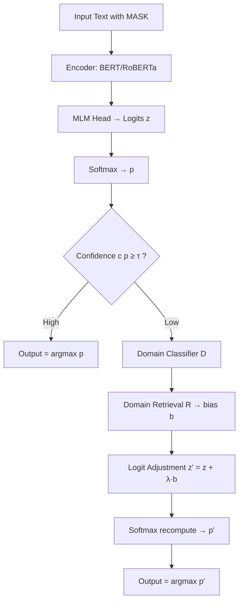
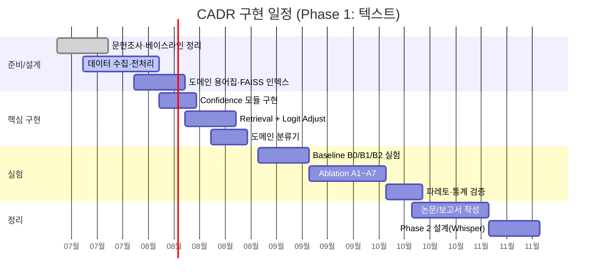

# Confidence-Aware Domain Retrieval for Subtitle Post-processing
### 연구 계획서 (Extended Research Plan v2)

---

## 목차

1. 연구 목표
2. 연구 동기 및 기존 RAG의 한계 분석
3. 기존 연구와의 비교 (Self-RAG / FLARE / Adaptive-RAG / Retrieval-on-Demand)
4. 연구 범위
5. 제안 모델 아키텍처 (Block Diagram)
6. Retrieval Trigger 알고리즘 및 수식
7. Logit Adjustment 수식
8. 데이터셋
9. 평가 지표
10. 실험 설계 및 Ablation Study
11. 예상 성능 및 계산 복잡도 분석
12. 구현 일정 (Gantt Chart)
13. 향후 Whisper 적용 전략
14. 기대 효과 및 핵심 차별점

---

## 1. 연구 목표

기존 ASR 전체를 새로 개발하지 않고, **모델이 불확실한 순간에만 Retrieval을 수행하여
예측을 보정하는 후처리 프레임워크(Confidence-Aware Domain Retrieval, CADR)** 를 제안한다.

> **핵심 질문**
> 모델의 내부 불확실성(Confidence)을 Retrieval Trigger로 사용하고,
> 그 결과를 생성 이후가 아니라 **예측(Logit) 단계에서 보정**할 경우,
> 기존 RAG 대비 **더 적은 Retrieval 호출로 동등하거나 더 높은 도메인 정확도**를
> 달성할 수 있는가?

세부 목표는 다음과 같다.

- (G1) Retrieval Trigger를 입력이 아닌 **모델 내부 상태(confidence)** 로 정의하고 검증한다.
- (G2) Retrieval 결과를 **logit bias** 형태로 주입하여 재생성 없이 예측을 교정한다.
- (G3) Retrieval 호출 비율 대비 정확도의 **파레토(Pareto) 우위**를 실증한다.
- (G4) 텍스트(MLM) 환경에서 검증 후 Whisper Decoder로 확장 가능한 일반 알고리즘을 확립한다.

---

## 2. 연구 동기 및 기존 RAG의 한계 분석

### 2.1 문제 상황: 자막에서의 도메인 오류

ASR/자막 시스템은 일반 도메인에서는 잘 동작하지만, **도메인 특화 용어, 신조어(밈),
고유명사**에서 체계적으로 실패한다. 예를 들어:

| 입력(발화) | 일반 모델 예측 | 실제 의도 | 오류 유형 |
|---|---|---|---|
| "He got **cooked**." | "He got cooked(요리됨)" | (게임/스포츠) 완전히 발림 | 신조어 |
| "The team used a high **press**." | "high **price**" | (축구) 하이 프레스 | 동음/도메인 |
| "The model uses **LoRA**." | "the model uses **Laura**" | (AI) LoRA 기법 | 전문용어/고유명사 |

이 오류들의 공통점은 **음향/언어 모델 자체의 확률 분포가 모호(low-margin)** 하다는 것이다.
즉, 모델은 "자신이 헷갈린다"는 신호를 이미 내부적으로 가지고 있다.

### 2.2 기존 RAG의 한계

1. **무조건적 Retrieval (Retrieve-always)**
   - 입력마다 또는 문장마다 검색을 수행 → 대부분의 쉬운 입력에서 **불필요한 검색 비용** 발생.
   - 실시간 자막처럼 latency가 중요한 환경에서 치명적.

2. **입력 기반 Trigger의 한계**
   - "질문이 복잡한가?"를 입력 텍스트로만 판단 → 모델이 **실제로 헷갈리는지**와 불일치.
   - 쉬워 보이지만 도메인 지식이 필요한 짧은 발화("He got cooked")를 놓친다.

3. **생성 이후(Post-generation) 개입**
   - 대부분의 RAG는 검색 결과를 **프롬프트에 이어붙여 재생성**한다.
   - 재생성은 (a) 비용이 크고 (b) 원래 모델의 음향적 근거를 흐리며 (c) 토큰 단위 자막 스트림에
     적용하기 어렵다.

4. **보정 지점의 불투명성**
   - 검색 결과가 최종 출력에 어떻게 반영되는지 통제하기 어렵다(hallucination 재주입 위험).

### 2.3 본 연구의 착안점

- Retrieval을 **필요할 때만**(confidence 기반) → 비용 절감.
- 보정을 **logit 단계**에서 수행 → 음향/언어 모델의 원 예측을 보존하면서 도메인 지식만 가산.
- 이는 kNN-LM류의 분포 보간과 FLARE류의 confidence trigger를 **결합·재배치**한 설계이다.

---

## 3. 기존 연구와의 비교

| 항목 | Retrieve-always RAG | Self-RAG | FLARE | Adaptive-RAG | **본 연구 (CADR)** |
|---|---|---|---|---|---|
| Trigger 기준 | 항상 | 학습된 reflection token | **미래 문장의 저확신 토큰** | 입력 질문 복잡도 분류기 | **현재 예측의 confidence(margin/entropy)** |
| Trigger 신호원 | 없음 | 모델(학습 필요) | 모델 confidence | 입력 텍스트 | **모델 내부 상태(무학습 가능)** |
| 보정 방식 | 프롬프트 결합 후 재생성 | 재생성 + self-critique | 재검색 후 **재생성** | 경로 라우팅 후 생성 | **Logit bias 주입(재생성 없음)** |
| 개입 지점 | 입력/생성 | 생성 | 생성 | 생성 | **예측(logit) 단계** |
| 주 타깃 | QA/생성 | QA/사실성 | Long-form 생성 | Multi-hop QA | **ASR/자막 후처리, 도메인 용어** |
| 학습 비용 | 낮음 | 높음(특수 토큰 학습) | 낮음 | 중간(분류기 학습) | **낮음(Phase1 무학습, Phase2 옵션)** |

**정리 및 차별점(Positioning).**
FLARE는 이미 "낮은 confidence를 retrieval trigger로 쓴다"는 점에서 본 연구와 trigger 철학을
공유한다. 따라서 본 연구의 신규성은 *trigger 개념 그 자체*가 아니라 다음 세 축의 결합에 있다.

1. **개입 지점의 이동**: 재생성이 아니라 **logit 보정**으로 도메인 지식을 주입 → 토큰
   스트림/실시간 자막에 적합.
2. **도메인 라우팅 + 용어집 결합**: 자유 텍스트 문서 검색이 아니라 **도메인 판별 → 도메인
   용어집 기반 logit bias**로 hallucination 재주입을 억제.
3. **무학습 baseline의 실용성**: Phase 1은 학습 없이 통계적 confidence만으로 동작 →
   후처리 모듈로 즉시 이식 가능.

---

## 4. 연구 범위

### Phase 1 (텍스트, 본 계획서 핵심)
- 음성 입력 제외.
- BERT/RoBERTa 기반 Masked Language Modeling(MLM) 환경.
- Confidence-aware Retrieval 및 Logit Adjustment의 유효성 검증.

### Phase 2 (음성 확장)
- Whisper Decoder 또는 기타 ASR Decoder에 동일 알고리즘 적용(13절 참조).

---

## 5. 제안 모델 아키텍처 (Block Diagram)

### 5.1 텍스트 표현

```
    Text (with [MASK])
     │
     ▼
   Encoder (BERT / RoBERTa)
     │
     ▼
   MLM Head → Logits  z ∈ R^{|V|}
     │
     ▼
   Softmax → p = softmax(z)
     │
     ▼
   Confidence Estimation  c(p)
     │
     ├── c ≥ τ  (High) ─────────────► Output token = argmax p
     │
     └── c <  τ  (Low)
              │
              ▼
        Domain Classifier  d = D(context)
              │
              ▼
        Domain Retrieval  R(context, d) → bias vector b ∈ R^{|V|}
              │
              ▼
        Logit Adjustment  z' = z + λ·b
              │
              ▼
        Softmax (recompute) → p' = softmax(z')
              │
              ▼
           Output token = argmax p'
```

### 5.2 Mermaid 다이어그램



---

## 6. Retrieval Trigger 알고리즘 및 수식

마스크 위치의 어휘 분포를 `p = (p_1, ..., p_{|V|})`, 내림차순 정렬을
`p_(1) ≥ p_(2) ≥ ...` 라 하자.

### 6.1 Confidence 측정 후보

**(a) Maximum Probability**

$$
c_{\max}(p) = \max_{v} p_v = p_{(1)}
$$

**(b) Top1–Top2 Margin**

$$
c_{\text{margin}}(p) = p_{(1)} - p_{(2)}
$$

**(c) Entropy (정규화)**

$$
H(p) = -\sum_{v=1}^{|V|} p_v \log p_v,
\qquad
c_{\text{ent}}(p) = 1 - \frac{H(p)}{\log |V|} \in [0,1]
$$

엔트로피가 클수록(=불확실) `c_ent`는 작아지도록 정규화한다.

**(d) 결합 스코어 (선택적)**

$$
c(p) = w_1\, c_{\max} + w_2\, c_{\text{margin}} + w_3\, c_{\text{ent}},
\qquad \textstyle\sum_i w_i = 1
$$

### 6.2 Trigger 규칙

임계값 `τ`에 대해 retrieval 여부를 이진 결정한다.

$$
\text{Retrieve}(p) =
\begin{cases}
1 & \text{if } c(p) < \tau \\[4pt]
0 & \text{otherwise}
\end{cases}
$$

Entropy 단독 사용 시에는 부호가 반대이므로 `H(p) > τ_H` 로 트리거한다.

### 6.3 Pseudocode

```python
def predict_token(context, mask_pos, tau, lambda_):
    z = mlm_head(encoder(context))[mask_pos]     # logits, shape [|V|]
    p = softmax(z)

    c = confidence(p)          # c_max / c_margin / c_ent / weighted
    if c >= tau:
        return argmax(p)       # High confidence: no retrieval

    domain = classify_domain(context)            # Sports/Game/AI/Cooking/Music
    b = retrieve_bias(context, domain)           # bias vector, shape [|V|]
    z_adj = z + lambda_ * b
    p_adj = softmax(z_adj)
    return argmax(p_adj)
```

`τ`는 (i) 고정 하이퍼파라미터, (ii) 검증셋에서 목표 retrieval 비율에 맞춰 캘리브레이션,
(iii) 학습형 controller(후속 연구)로 확장 가능하다.

---

## 7. Logit Adjustment 수식

Retrieval은 문맥과 도메인에 근거하여 각 어휘 `v`에 대한 **도메인 적합도 점수** `s_v`를 만든다.
이를 두 가지 방식으로 logit에 반영한다.

### 7.1 방식 A — Additive Logit Bias

검색 결과 집합 `R`(도메인 용어집/문서에서 얻은 후보와 유사도)로부터 bias를 정의한다.

$$
b_v = \log\!\big(\text{count}_R(v) + \alpha\big)
\quad\text{또는}\quad
b_v = \frac{\exp(s_v/T)}{\sum_{u} \exp(s_u/T)}
$$

여기서 `s_v`는 문맥 임베딩과 후보 용어 임베딩 간 유사도, `T`는 temperature, `α`는 스무딩 상수.
보정 logit과 최종 분포는

$$
z'_v = z_v + \lambda\, b_v,
\qquad
p'_v = \frac{\exp(z'_v)}{\sum_{u}\exp(z'_u)}
$$

`λ`는 도메인 지식 주입 강도를 조절한다(`λ=0`이면 baseline과 동일).

### 7.2 방식 B — 분포 보간 (kNN-LM style)

검색 분포 `p_R`를 별도로 만들고 모델 분포와 보간한다.

$$
p_R(v) \propto \sum_{(k_i, v_i)\in R} \mathbb{1}[v_i = v]\,
\exp\!\Big(-\frac{\lVert q - k_i \rVert^2}{T}\Big)
$$

$$
p'(v) = (1-\beta)\, p_{\text{LM}}(v) + \beta\, p_R(v),
\qquad \beta \in [0,1]
$$

`q`는 마스크 위치의 질의 임베딩, `k_i`는 검색된 키 임베딩. 방식 B는 logit이 아닌 확률 공간에서의
보간이라 해석이 직관적이며, 방식 A는 재정규화 없이 가산만으로 가능해 구현이 단순하다.
**두 방식을 Ablation에서 비교한다.**

### 7.3 예시

| | press | price |
|---|---|---|
| 초기 `p` | 0.43 | 0.41 |
| Retrieval: Domain = Football, `b_press` ↑ | | |
| 보정 후 `p'` (λ 적용) | **0.62** | 0.30 |

→ 최종 선택: `press` (도메인 정합).

---

## 8. 데이터셋

### 8.1 학습/인덱스 구축
- Wikipedia (일반 지식)
- Reddit (구어/신조어)
- YouTube Transcript (자막 도메인 분포)
- 나무위키 (한국어 용어 사전, 도메인 용어집 시드)

### 8.2 도메인 용어집(Retrieval Index)
- 도메인별 용어·밈·고유명사·전문용어를 정규화하여 임베딩 인덱스(FAISS)로 구축.
- 도메인: **Sports / Game / AI / Cooking / Music**.

### 8.3 평가셋 (Ambiguity Benchmark)
애매한 표현을 포함한 문장을 별도 구축한다. 각 문장은 (문맥, 마스크 위치, 정답, 도메인 라벨,
혼동 후보)로 구성.

예시:
- He got \_\_\_\_. → cooked (Game/Sports)
- The team used a high \_\_\_\_. → press (Football)
- Bro is \_\_\_\_. → cooking (meme)
- The model uses \_\_\_\_. → LoRA (AI)

각 도메인당 최소 300문장, 총 1,500문장 이상을 목표로 하며, 일반 도메인 대조군을
동일 규모로 포함한다.

---

## 9. 평가 지표

**정확도**
- Top-1 Accuracy
- MLM Accuracy
- Domain Term Accuracy (도메인 용어 정답률, 핵심 지표)

**효율성**
- Retrieval 호출 비율 `ρ = (#retrieve)/(#tokens)`
- 평균 Latency (ms/token)
- 평균 추론 시간

**비교군(Baselines)**
- (B0) Baseline BERT (retrieval 없음)
- (B1) BERT + Always Retrieval
- (B2) **BERT + Confidence Retrieval (제안, CADR)**

**핵심 리포팅**: `Domain Term Accuracy` vs `ρ`의 파레토 곡선 — 적은 검색으로 높은 정확도를
보이면 성공.

---

## 10. 실험 설계 및 Ablation Study

### 10.1 주요 실험
- E1. B0/B1/B2 전체 비교 (정확도·효율성).
- E2. 도메인별 성능 분해 (Sports/Game/AI/Cooking/Music).
- E3. 파레토 분석: `τ` 스윕에 따른 (ρ, Domain Term Acc) 곡선.

### 10.2 Ablation Study

| Ablation | 변인 | 목적 |
|---|---|---|
| A1. Confidence metric | max / margin / entropy / weighted | 최적 trigger 신호 규명 |
| A2. Threshold τ | 0.1 ~ 0.9 스윕 | 정확도–비용 트레이드오프 |
| A3. Adjustment 방식 | Additive(A) vs Interpolation(B) | 보정 방식 효과 |
| A4. 보정 강도 λ / β | 0, 0.25, 0.5, 0.75, 1.0 | 과보정/과소보정 경계 |
| A5. Retrieval source | 용어집만 / 문서만 / 둘다 | 지식원 기여도 |
| A6. Domain routing | 유(有) vs 무(無, 전역 검색) | 도메인 판별의 가치 |
| A7. Oracle 상한 | 정답 도메인·정답 용어 주입 | 성능 상한(upper bound) 추정 |

### 10.3 통계적 검증
- 3-seed 평균 ± 표준편차 리포팅.
- B1 대비 B2의 정확도 차이는 paired bootstrap(≥1,000 resample)으로 유의성 검증.

---

## 11. 예상 성능 및 계산 복잡도 분석

### 11.1 예상 성능 (목표치, 가설)

> 아래 수치는 검증으로 확인할 **목표/가설**이며 실측치가 아니다.

| 모델 | Domain Term Acc | Retrieval 비율 ρ | 상대 Latency |
|---|---|---|---|
| B0 Baseline | ~62% | 0% | 1.0× |
| B1 Always Retrieval | ~81% | 100% | ~2.3× |
| **B2 CADR (제안)** | **~79–82%** | **~20–30%** | **~1.3–1.4×** |

기대 골자: B2는 B1 대비 **검색 호출을 70~80% 절감**하면서 정확도는 **동등(±2%p)** 유지.

### 11.2 계산 복잡도

인코더 forward 비용을 `C_enc`, 단일 retrieval 비용을 `C_ret`, logit 보정 비용을 `C_adj`라 하면:

- **Baseline (B0)**: `C_enc`
- **Always (B1)**: `C_enc + C_ret + C_adj`
- **CADR (B2)**: `C_enc + ρ·(C_ret + C_adj)`,  단 `ρ = P(c(p) < τ)`

절감량:

$$
\Delta = (1-\rho)\,(C_{\text{ret}} + C_{\text{adj}})
$$

- Retrieval 자체 비용 `C_ret`: 질의 임베딩 `O(d)` + ANN 검색(FAISS HNSW) `~O(\log N)`.
- Confidence 계산 `c(p)`: 이미 계산된 softmax에 대해 `O(|V|)`(정렬 top-2는 `O(|V|)`), 사실상
  무시 가능한 추가 비용.
- 결론: `ρ`가 작을수록 B1 대비 선형적으로 비용이 감소하며, confidence 계산 오버헤드는
  retrieval 절감분에 비해 미미하다 → **순이득**.

---

## 12. 구현 일정 (Gantt Chart)



(주: 날짜는 착수 시점 기준 예시이며 실제 일정에 맞춰 조정한다.)

---

## 13. 향후 Whisper 적용 전략

Phase 1에서 확립한 (confidence trigger → logit adjustment) 알고리즘을 Whisper의
**autoregressive decoder**에 이식한다.

### 13.1 매핑
- BERT MLM logits ↔ Whisper decoder의 **step별 vocabulary logits**.
- 마스크 위치 판단 ↔ **디코딩 각 스텝**에서 confidence 계산.
- 도메인 용어집 bias ↔ 동일하게 step logits에 `z' = z + λ·b` 가산.

### 13.2 도전 과제와 대응
1. **자기회귀 오류 전파**: 잘못 보정된 토큰이 다음 스텝에 영향 → beam search 상에서
   보정을 적용하고, 낮은 confidence 스텝에만 개입해 보정 빈도를 제한.
2. **음향 근거 보존**: logit 가산 방식(A)은 음향 posterior를 유지한 채 도메인 prior만
   더하는 형태 → shallow fusion과 유사한 안정성.
3. **실시간 제약**: streaming 자막에서는 `ρ`를 낮게 유지(높은 τ) → latency budget 준수.
4. **텍스트-only 인덱스 재사용**: Phase 1의 도메인 용어집/FAISS 인덱스를 그대로 활용
   가능(음성 비의존).

### 13.3 평가 확장
- WER / Domain-term WER, 실시간 factor(RTF), retrieval 비율을 함께 리포팅.
- 스포츠 중계·게임 방송·기술 강연 등 도메인 자막에서 A/B 비교.

---

## 14. 기대 효과 및 핵심 차별점

**기대 효과**
- Retrieval 횟수 감소 → 평균 추론 시간·비용 감소.
- 도메인 용어 정확도 향상.
- 재생성 없는 logit 보정으로 실시간/스트리밍 자막에 적합.
- ASR 후처리 모듈로 손쉽게 확장.

**핵심 차별점**
본 연구는 Retrieval "여부"를 입력이 아니라 **모델의 불확실성**으로 결정하고,
그 결과를 생성 이후가 아니라 **예측(logit) 단계에서 보정**한다.
Confidence 기반 트리거는 FLARE와 철학을 공유하지만, 본 연구는
(1) **재생성이 아닌 logit bias 주입**, (2) **도메인 라우팅 + 용어집 기반 보정**,
(3) **무학습으로 이식 가능한 자막 후처리 파이프라인**이라는 결합에서 차별화된다.

### 향후 확장
- Whisper Decoder 적용
- Dynamic Threshold Learning (τ 학습)
- Retrieval Controller 학습 (trigger 정책 학습)
- Domain-specific Logit Bias 자동 학습
- 실시간 자막 시스템 통합
